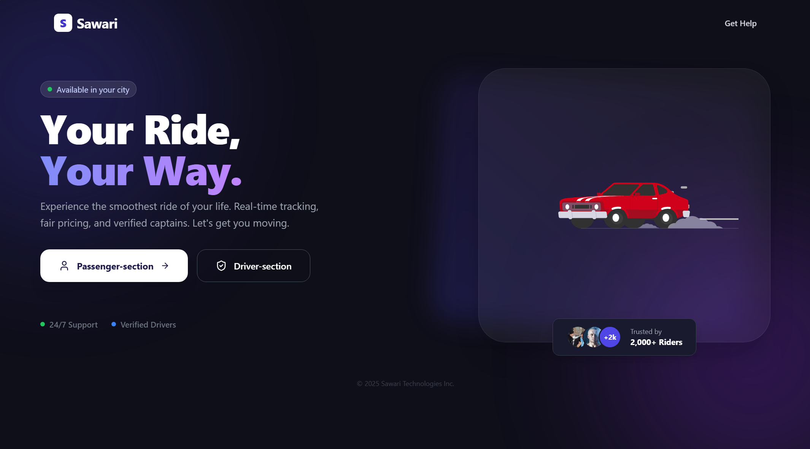
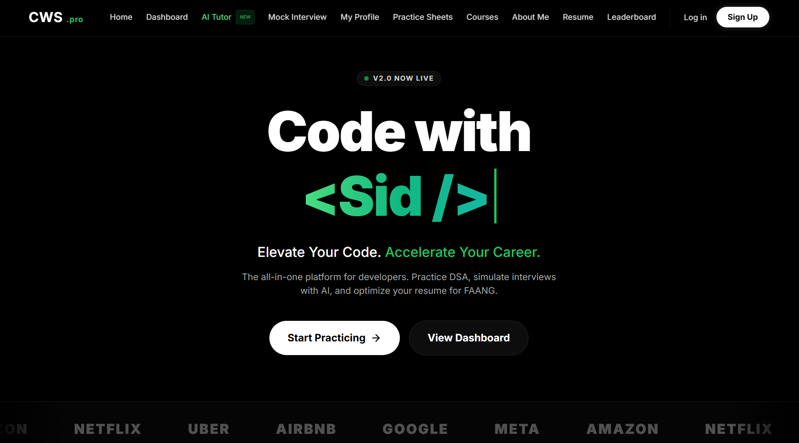
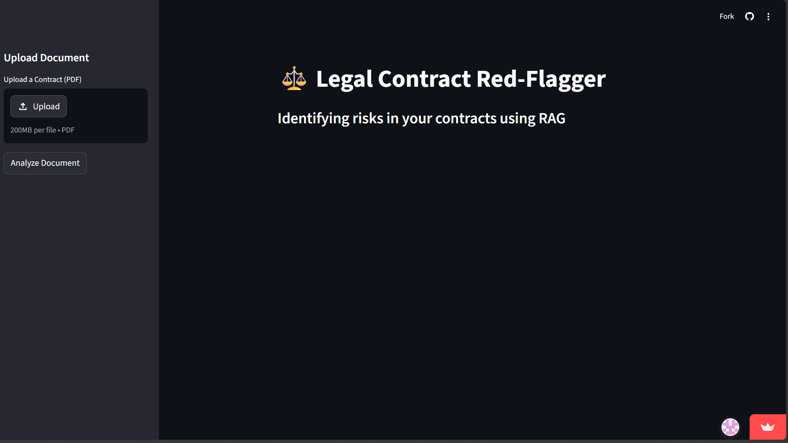

# 👋 Hi, I'm Siddharth Singh Baghel

### MERN Stack Developer | Full Stack Web Developer | AI Enthusiast

*"Building scalable web applications that combine modern UI, real-time systems, and AI-powered experiences."*

[🌐 Live Portfolio](https://portfolio-ui-0zpo.onrender.com/) •
[💻 GitHub](https://github.com/siddharthsinghbaghel) •
[🔗 LinkedIn](https://www.linkedin.com/in/siddharth-singh-b9a921259/) •
📧 siddharthsingh910989@gmail.com

---

# 🚀 About Me

I am a **MERN Stack Developer** passionate about building scalable, user-centric web applications. My primary focus is developing modern full-stack applications with clean architecture, responsive interfaces, real-time communication, and AI integrations.

I enjoy solving Data Structures & Algorithms, learning new technologies, and creating projects that solve real-world problems.

---

# 🛠 Tech Stack

## Frontend

- HTML5
- CSS3
- JavaScript (ES6+)
- React.js
- Tailwind CSS

## Backend

- Node.js
- Express.js

## Database

- MongoDB

## Programming Languages

- C++
- JavaScript
- Python

## Tools & Technologies

- Git
- GitHub
- VS Code
- Postman
- Socket.io
- Google Maps API
- JWT Authentication
- Gemini API
- LangChain
- Streamlit

---

# 📂 Featured Projects

## 🚖 Sawari — Ride Hailing Ecosystem

**Tech Stack**

React • Node.js • Express.js • MongoDB • Socket.io • Google Maps API • JWT

### Features

- Real-time ride booking
- Rider & Driver dashboards
- Live ride updates using Socket.io
- Google Maps integration
- JWT Authentication
- AI-powered Location Assistant using Gemini API
- Responsive UI

🔗 Live Demo

https://sawari-front.onrender.com/

---

## 🎓 CWS — AI Powered Educational Platform

**Tech Stack**

Next.js • MongoDB • Gemini API • LangChain

### Features

- AI Tutor
- Mock Interview
- Resume ATS Analyzer
- PDF Question Answering
- Course Management
- Context-aware AI using LangChain

🔗 Live Demo

https://cws-bhm3.vercel.app/

---

## ⚖️ Legal Contract Red Flagger

**Tech Stack**

Python • Streamlit • RAG • Gemini AI

### Features

- Upload PDF contracts
- AI-powered contract analysis
- Detect legal red flags
- RAG based document understanding
- Instant risk identification

---

## 🎲 Random GIF Generator

**Tech Stack**

React • REST API

### Features

- Generate random GIFs
- Search custom GIFs
- API Integration
- Responsive UI

---

# 📸 Project Gallery

## 🚖 Sawari

---

## 🎓 CWS

---

## ⚖️ Legal Contract Red Flagger

---

## 🎲 Random GIF Generator

# 💡 What I Love Building

✔ Full Stack Web Applications

✔ AI Integrated Applications

✔ Real-Time Systems

✔ REST APIs

✔ Responsive User Interfaces

✔ Authentication Systems

✔ Problem Solving using DSA

---

# 📈 Currently Learning

- Advanced MERN Architecture
- Next.js
- TypeScript
- System Design
- Generative AI
- Cloud Deployment

---

# 📬 Connect With Me

📧 Email

**siddharthsingh910989@gmail.com**

🌐 Portfolio

https://portfolio-ui-0zpo.onrender.com/

💻 GitHub

https://github.com/siddharthsinghbaghel

🔗 LinkedIn

https://www.linkedin.com/in/siddharth-singh-b9a921259/

---

### ⭐ If you like my work, consider giving this repository a Star!

Thanks for visiting my portfolio.

